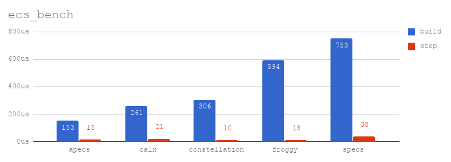

# apecs [](https://travis-ci.org/jonascarpay/apecs)
apecs is an _Entity Component System_ (ECS) library inspired by [specs](https://github.com/slide-rs/specs) and [Entitas](https://github.com/sschmid/Entitas-CSharp).
ECS presents a data-driven approach to game development, that elegantly tackles many of the unique issues of game programming.

apecs aims to be
* **Fast** - Performance is competitive with Rust ECS libraries (see benchmark results below).
* **Concise** - Game logic is expressed using a small number of powerful combinators.
* **Safe** - The `cmap`/`cfold`-DSL completely hides the dangers of the low-level API.
* **Extensible** - At its heart apecs is just a data manipulation DSL that can be implemented with any number of backends. As a monad transformer it easily integrates into larger applications.
* **Cool**



#### Links
- [documentation on hackage](https://hackage.haskell.org/package/apecs/docs/Apecs.html)
- [tutorial](examples/Shmup.md) and other [examples](examples/)
- [paper (prepublication)](apecs/prepub.pdf) (see [#19](https://github.com/jonascarpay/apecs/issues/19))
- [apecs-physics](apecs-physics/) - 2D physics using the [Chipmunk2D](https://github.com/slembcke/Chipmunk2D) engine
- [apecs-gloss](apecs-gloss/) - Simple frontend for [gloss](http://hackage.haskell.org/package/gloss)-based rendering
- [apecs-stm](apecs-stm/) - STM-based stores for easy concurrency

##### By other authors
- [An Introduction to Developing Games in Haskell with Apecs](https://blog.aas.sh/posts/2018-09-10-Making-A-Game-With-Haskell-And-Apecs/) by Ashley Smith

#### Status
| Package | Hackage | Stack LTS | Stack Nightly |
|---|---|---|---|
| [apecs](apecs/) | [](https://hackage.haskell.org/package/apecs) | [](https://www.stackage.org/package/apecs) | [](https://www.stackage.org/package/apecs)
| [apecs-physics](apecs-physics/) |  [](https://hackage.haskell.org/package/apecs-physics) | [](https://www.stackage.org/package/apecs-physics) | [](https://www.stackage.org/package/apecs-physics) |
| [apecs-gloss](apecs-gloss/) | [](https://hackage.haskell.org/package/apecs-gloss) | [](https://www.stackage.org/package/apecs-gloss) | [](https://www.stackage.org/package/apecs-gloss) |
| [apecs-stm](apecs-stm/) | [](https://hackage.haskell.org/package/apecs-stm) | - | - |
| [examples](examples/) | - | - | - |

#### Example
```haskell
{-# LANGUAGE FlexibleInstances     #-}
{-# LANGUAGE MultiParamTypeClasses #-}
{-# LANGUAGE ScopedTypeVariables   #-}
{-# LANGUAGE TemplateHaskell       #-}
{-# LANGUAGE TypeFamilies          #-}

import Apecs
import Linear (V2 (..))

newtype Position = Position (V2 Double) deriving Show
newtype Velocity = Velocity (V2 Double) deriving Show
data Flying = Flying

makeWorldAndComponents "World" [''Position, ''Velocity, ''Flying]

game :: System World ()
game = do
  newEntity (Position 0, Velocity 1)
  newEntity (Position 2, Velocity 1)
  newEntity (Position 1, Velocity 2, Flying)

  -- 1. Add velocity to position
  -- 2. Apply gravity to non-flying entities
  -- 3. Print a list of entities and their positions
  cmap $ \(Position p, Velocity v) -> Position (v+p)
  cmap $ \(Velocity v, _ :: Not Flying) -> Velocity (v - V2 0 1)
  cmapM_ $ \(Position p, Entity e) -> liftIO . print $ (e, p)

main :: IO ()
main = initWorld >>= runSystem game
```
